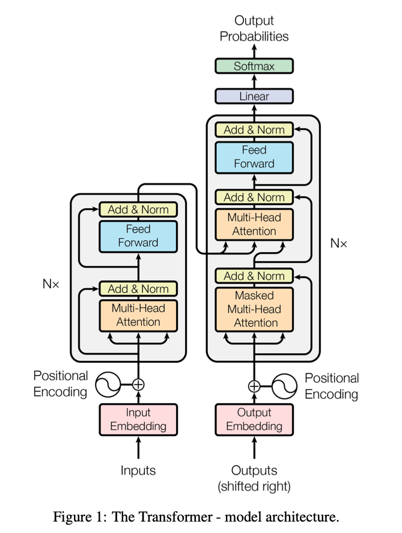

# Evolved Transformer

Paper: **[The Evolved Transformer](https://arxiv.org/abs/1901.11117)** 

## Introduction
This paper improves The [Transformer](https://arxiv.org/abs/1706.03762) by searching for better architecture using an evolutionary algorithm.

The search space is similar to NASNet, in that it uses *cells*, within the cells are *blocks* which take two hidden states and produce one.

However, the search itself is different from NASNet.
They utilize an evolutionary algorithm (*[tournament selection](https://medium.com/@c4lv1nmcg0wan/genetic-algorithms-tournament-selection-b150bc76f0d8)*) and a novel method called *Progressive Dynamic Hurdles (PDH)* which tries to efficiently use *limited* computational resources.

## Methods
Tournament selection is a genetic algorithm which receives an initial population.
In this case represented by encoded network architecture. 
We define a *fitness* score: a function which assigns each individual a value of how good it is (eg. perplexity or BLEU for translation)

Each individual is trained and then evaluated.
The best individuals are call *parents* and are mutated (producing *children*).
Low performing models are removed from the population. 

### Search space
Search space has been created so that it could represent the Transformer.
It consists of two cells, one for encoder and one for decoder.
These cells contain block which can be repeated several times (as in the Transformer).
And the cells themselves can be repeated.

The encoding of an individual is this (see picture below): `[left input, left normalization, left layer, left relative output dimension, left activation, right input, right normalization, right layer, right relative output dimension, right activation, combiner function] × 14 + [number of cells] × 2`

where `14` is there because encoder has 6 blocks and decoder 8 and `2` there is ` type of cell in both encoder and decoder.
The specific *values* of each gene are described in Apendix B.

