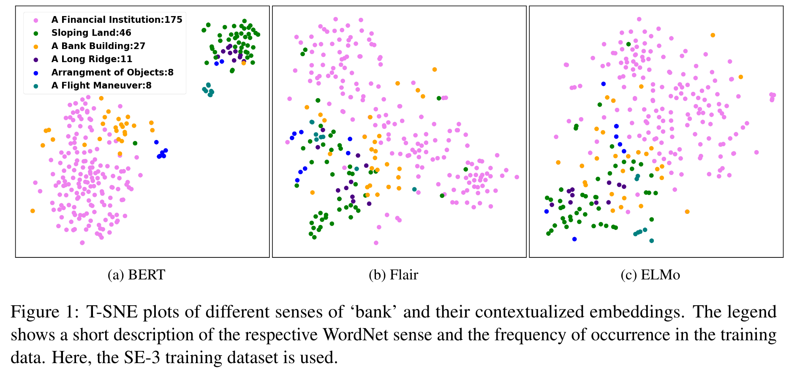
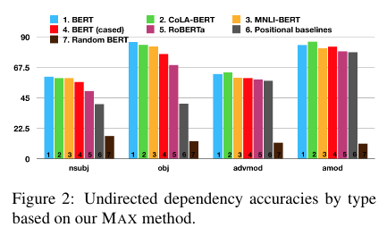
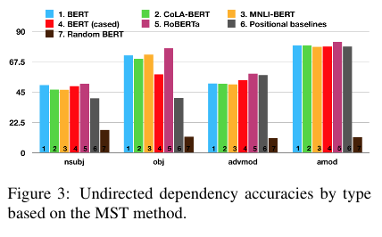
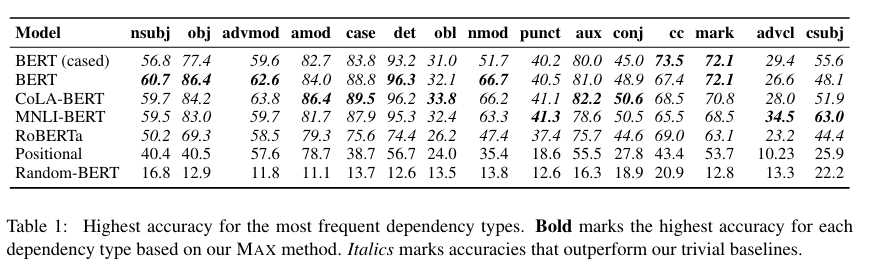
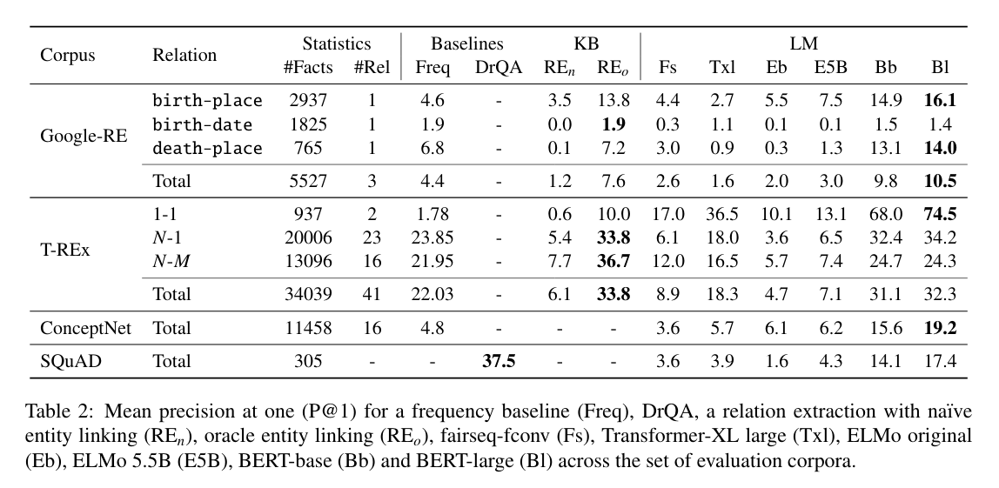

# Introduction

In this paper summary, I have decided to select papers from [A Primer in BERTology: What we know about how BERT works](https://arxiv.org/abs/2002.12327), which is a survey on BERT explainability. I assume that you have some knowledge of [Attention](https://arxiv.org/abs/1706.03762) and [BERT](https://arxiv.org/abs/1810.04805). In case you see the BERT model for the first time, I highly suggest [The Illustrated Transformer](https://jalammar.github.io/illustrated-transformer/) from Jay Alammar.

# Selected papers

## Does BERT Make Any Sense? Interpretable Word Sense Disambiguation with Contextualized Embeddings
[Paper](https://arxiv.org/abs/1909.10430)

In this paper, authors concluded research on word-sense disambiguation on context vectors from BERT, Flair and ELMo. The average value of tokens in the last five layers was used as a context vector in case of the BERT model. As a method which classifies data, they chose K-NN with cosine distance to find the word meaning based on a majority vote. The reason why they chose K-NN is the possibility to directly investigate the training examples that lead to a specific classifier decision.

As it can be seen in the picture above, only BERT made some clear clusters of different word meanings (at least in 2D with using T-SNE). In the error analysis, the researchers found out that K-NN using BERT vectors made many nearly misses, meaning that the class which won the majority vote, won only by few cases. Because of this, the authors hypothesize that the main reason behind the errors is the sparsity of the training data. In the future, the authors want to do the same research for XLM, RoBERTa and XLNet to find out if these model create better contextual representations.

Conclusion:
BERT creates different embeddings for different word meanings.

## Do Attention Heads in BERT Track Syntactic Dependencies?
[Paper](https://arxiv.org/abs/1911.12246)

In this paper, the authors investigate the hypothesis that BERT-style models use at least some of their attentions heads to track syntactic dependency relationships between words. They used two methods to extract dependencies relationships to extract the dependency relationships from self-attention heads from BERT and RoBERT. 

1. Maximum attention weights (MAX)
This method designates the word with the highest incoming attention weight as the parent and is meant to identify specialist heads that track specific dependencies like `obj`. So for a given token A, a token B that has the highest attention weight with respect to the token A should be related to token A. Our aim is to investigate whether this relation maps to a universal dependency relation. The authors assign relation between word w_i and w_j if j = argmax in a row. Based on this strategy, they extract relations for all sentences from the dataset. 

2. Maximum spanning tree
Computes a maximum spanning tree over the attention matrix, and is meant to identify generalist heads that can form complete, syntactically informative dependency trees. The authors treat the attention matrix of attention weights as a complete weighted directed graph and compute the maximum spanning tree from the golden root (which is given). 

To evaluate the ability of the model to encode the dependencies, they use English Parallel Universal Dependencies (PUD). They use BERT large, BERT large cased, CoLA BERT (finetuned on CoLA dataset), MNLI-BERT (finetuned on MNLI dataset), RoBERTa, Random BERT (randomly initialized BERT) and relative positional baseline (computed from most common positional offset). From the graph above it can be seen, that there are certain specialist attention heads of the models that track specific dependency types, but neither of their analysis methods supports the existence of generalist heads that can perform general parsing.

## Language Models as Knowledge Bases?
[Paper](https://arxiv.org/abs/1909.01066)

In this paper, authors investigate the idea of using Language model as a Knowledge base. In short, language models (LM) are models, that estimates the probability of a word given its context. To evaluate the ability of the language model to answer questions, they use these datasets:

1. Google-RE
Google-RE is corpus containing around 60 000 facts extracted from Wikipedia. It covers five different relationships “place of birth”, “date of birth”, “place of death”, "education degree" and "institution". The authors have chosen to use only the first three relationships since the last two can contain multi-token objects that they didn't want to support. They manually defined template for each question. For example “[S]was born in [O]” for “place of birth”. 

2. T-REX
T-REX is a knowledge source derived from Wikipedia and is much larger next Google-RE with a broader set of questions. They consider 41 Wikidata relations and subsample at most 1000 facts per relation. In contrast to the Google-RE knowledge source, T-REx facts were automatically aligned to Wikipedia, and hence this alignment can be noisy. Some example of questions is "Carl III used to communicate in [?].", "Border TV is owned by [?]", etc.

3. ConceptNET
ConceptNET is a multilingual knowledge base, initially built on top of Open Mind Common Sense (OMCS) sentences. The authors considered only facts from the English part of ConceptNet that have single token objects covering 16 relations. 

4. SQuAD
The authors selected a subset of 305 context-insensitive questions from the SQuAD development set with single token answers. They rewrote the questions manually to fit their case. For example, rewriting “Who developed the theory of relativity?” as “The theory of relativity was developed by [?]”.

To compare the LM to systems similar to knowledge bases, they use these type of systems:

1. Freq
For a subject and relation pair, this baseline ranks words based on how frequently they appear as objects for the given relation in the test data. It indicates the upper bound performance of a model that always predicts the same objects for a particular relation.

2. RE
For the relation-based knowledge sources, they considered the pretrained Relation Extraction (RE) model of  [Sorokin and Gurevych (2017)](https://www.aclweb.org/anthology/D17-1188/). This model was trained on Wikipedia annotated with Wikidata relations. It extracts relation triples from a given sentence using an LSTM-based encoder and an attention mechanism. They used two different types of entity linking. RE-n which makes use of naive entity linking solution based on exact string matching and RE-o which uses an oracle for entity linking in addition of matching.

3. DrQA
DrQA predicts answers to natural language questions using a two-step pipeline. First, a TF/IDF information retrieval step is used to find relevant articles from a large store of documents (e.g.Wikipedia). On the retrieved top-k articles, a neural reading comprehension model then extracts answers. 

As it can be seen in the picture above, the BERT-large was able to recall knowledge better than its competitors and at a level remarkably competitive with non-neural and supervised alternatives. The authors suspected that language models trained on ever-growing corpora might become a viable alternative to traditional knowledge bases extracted from text in the future. 

# My opinion
BERTology paper

Likes:
- the paper is a comprehensive study on BERT explainability 

Dislikes:
- it is very hard to name some dislikes since this paper mainly cites other papers

Other papers:

Does BERT Make Any Sense? Interpretable Word Sense Disambiguation with Contextualized Embeddings

Likes:
- the error analysis which allowed them to postulate a hypothesis

Dislikes:
- they could compare other models than only three

Do Attention Heads in BERT Track Syntactic Dependencies?

Likes:
- I liked that they tried many types of BERT like models

Dislikes:
- I think they could include some examples of the MAX or MST analysis on some selected sentence

Language Models as Knowledge Bases?

Likes:
- comparison of many models

Dislikes:
- only one token answers would be interesting to see how models could deal with more tokens